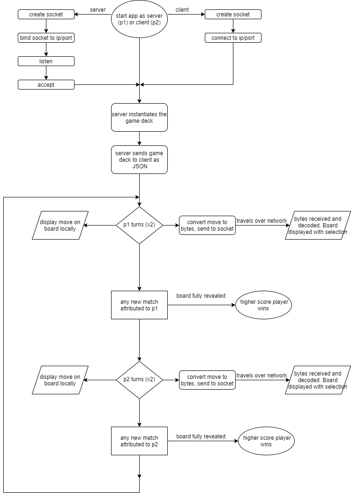

# 1) Develop and describe an algorithmic solution for an application that utilises two way communication over a network (300 - 500 words)
## Multi-player Memory
The ubiquitous game of Memory can in real life be played with multiple players.
The following solution describes the development of a terminal-based 2-player
version of the game to be played on 2 computers over a network.
    

The Solution Must:
## Describe how input and output will be handled
 - Input is typed directly into the terminals of both players. 
 - Output is printed to the terminals of both players.
 - Game board is converted to JSON and sent from server to client over network at the start of each game
 - Each players' moves are sent over the network to be viewed by the other player simultaneously

## Detail how the solution will be structured in terms of classes, functions and other entities
Files:
  - classes.py
    - Classes and class methods for game function.
  - server.py
    - Server runs only this file. Plays game as player 1
  - client.py
    - Client runs only this file. Plays game as player 2

 - class: Board
   - Attributes:
     - card deck (dictionary)
   - Methods:
     - init: Generates randomly shuffled card deck (dictionary)
     - display(): Prints the card deck on a board with revealed cards supplied as args

 - class: Game
   - Attributes:
     - board: See Board class.
     - p1_score: player 1 score.
     - p2_score: player 2 score.
   - methods:
     - init: Instantiates a Board, displays welcome message and rules.
     - is_game_finished(): Checks the game's card deck for the win condition.
     - is_invalid_input(): Ensures input for each turn is valid.
     - turn1(): Takes move input and displays board with a card flipped.
     - turn2(): Takes move input and displays board with two cards flipped.
     - match(): Checks turn1() and turn2() selections for match. Awards points to player who matched.
     - display_score(): Displays both players' score
     - game_over(): Displays end of game message. Indicates winner

 - class MyServer
   - Initialises a server socket and handles connection to client

 - class MyClient
   - Initialises a client socket and handles connection to server

## illustrate how the algorithm will function
Network functionality comes from the python native socket module.
First the server instantiates the game's board/deck. The card deck is a dictionary which in order to send,
must first be converted to json format, then encoded to bytes using utf-8, then sent from socket to socket
before the reverse operation on the client end. The client then uses this board for the duration of the game.
As client and server now have identical boards and methods for scoring, the game state is tracked separately and only the player moves have to be sent over network.
Each turn the player's moves are displayed locally, while also being sent over the network
as packets of up to 1024 utf-8 encoded bytes using sendall(), then received and decoded using decode(). On the receiving end, the local board is then displayed using the received moves instead of typed inputs.

## list the Python dependencies required and state what each will be used for (this includes Python standard libraries as well as third-party packages)

### Python standard libraries:
 - random:
   - random.shuffle() randomises card positions on the board of each new game 
 - from os import system:
   - system('clear') clears the terminal window for game clarity
 - time:
   - time.perf_counter() tracks game time
 - socket:
   - socket.socket() opens sockets for connecting the hosts over network
   - socket.socket.bind() associates server's socket with ip and port
   - socket.socket.listen() instructs socket to await connection 
   - socket.socket.accept() return a socket representing connection and address of client
   - socket.socket.sendall() sends game data over network
   - socket.socket.recv() accepts game network data from socket 
 - json:
   - json.dumps() converts game board dictionary to json string for sending over network
   - json.loads() converts game board json back to python dictionary 
 - builtins:
   - decode(): decodes received bytes back into strings

# Develop a flowchart for an application that outlines the control flow of the app, and illustrates the operation of an algorithm based on the solution you have described.

